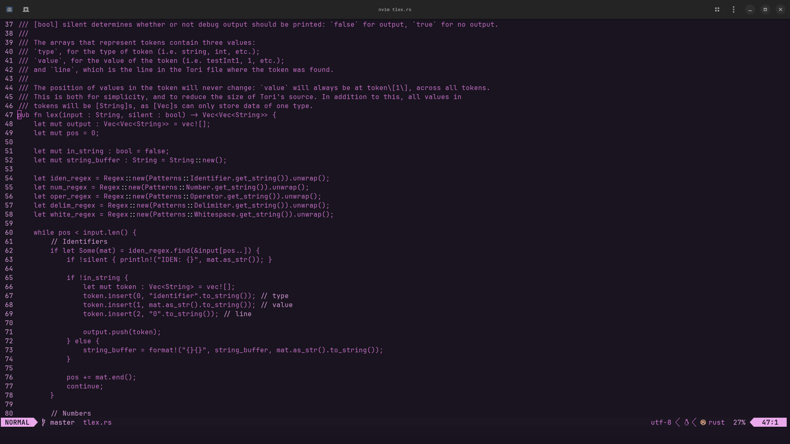
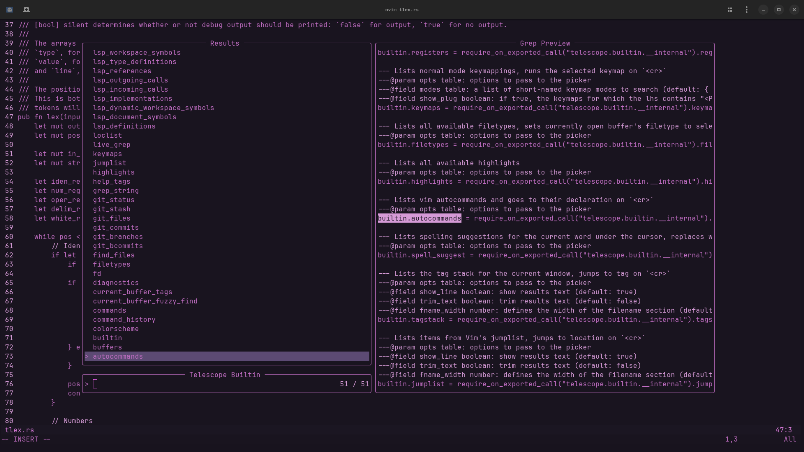

# nvim-sakura: A Sakura theme for Neovim
A theme based off of iterm's "Sakura" theme. Also based off of Neovim's "Quiet" theme.  
Made with [lush.nvim](https://github.com/rktjmp/lush.nvim).

## Installation (not yet tested)
Simply include "djaysky/nvim-sakura" to your plugin list.  
For example, if you are using [vim-plug](https://github.com/junegunn/vim-plug) (vim script):
```nvim
call plug#begin()
    " your other plugins here
    Plug 'djaysky/nvim-sakura'
call plug#end()
```
and then:
```
color nvim-sakura
```
to enable the theme.  
This theme is not tested on vim, only neovim (it might still work though, idrk).

## Screenshots


